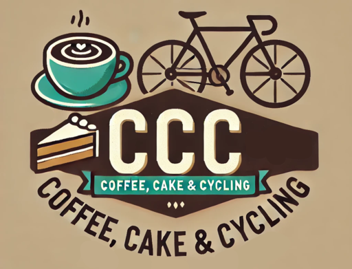

# CCC: Coffee, Cake & Cycling

🚴‍♂️🚵‍♀️ The place for cyclists to rate cafes based on their coffee stop experiences.

Where do they have YOUR favorite ☕coffee, 🍰cake and 🛠️cycling facilities?

## Description
As a cyclist myself, I regularly stop during my longer rides for a well-deserved coffee and a piece of cake. Coffee specifically is ingrained into cycling culture. Stopping for coffee allows cyclists to socialize, its caffeine provides a welcome energy boost on longer rides, and it goes well with cake to refuel during or after your ride.

CCC has the goal to provide cyclists with a way to share their favorite cafes. Had an excellent experience somewhere? Leave a review and together we can make cafes with great coffee, delicious cake and cyclist-friendly facilities more known.

Of course there are general platforms like Google Maps that collect reviews on all kinds of establishments. To a cyclist, however, certain features are more important than others. I argue that coffee and cake are at the center of any coffee stop experience. Then cycling-related facilities, e.g. secure bike parking, a tire pump, or repair kits, can further enhance the stop: a cleaning station after your muddy mountain bike ride can really improve your ride home. Therefore CCC focuses on these aspects to find the **best coffee stop cafes**.

#### Video Demo: [YouTube-link](https://youtu.be/ce14t8_9744)
## The project
The CCC project is written using the Django framework.  The project is divided into three main apps: users, cafes and reviews. 

-  It uses a combination of Bootstrap and custom CSS to style the website.
- 🗺️ It also makes use of the Google Maps API's to find and locate cafes on an interactive map.

### Users app
The users app is a simple custom users app that allows extra fields to be added to the standard asbtract user model. It is currently quite basic, but in time it will include more customization options (e.g. profile pictures).

### Cafes app
The cafes app contains all the functionality to create and manage cafes. It uses the Google Places API to get detailed information about the cafe, such as name, location, website and photos. The Cafe model saves the Google Place ID so it can always relate back to the Google database.

### Reviews app
The reviews app contains all the functionality to create reviews and ratings. It allows for simple star ratings without any text to full reviews (including a star rating). In time, it will incorporate separate ratings for the main features such as coffee, cake and cycling facilities.

### Google Maps API's
The project uses three Google API's:
- Maps JavaScript to embed a Google Maps widget on pages.
- Places API and Places API (New) to find detailed information on the cafe.

The Maps JavaScript functionality is altered so that it shows a custom InfoWindow with links to the CCC website that shows when interacting with a cafe. This allows for interactivity with the CCC website through the Google Maps widget.